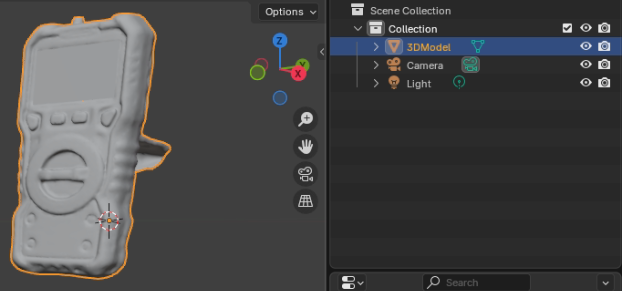
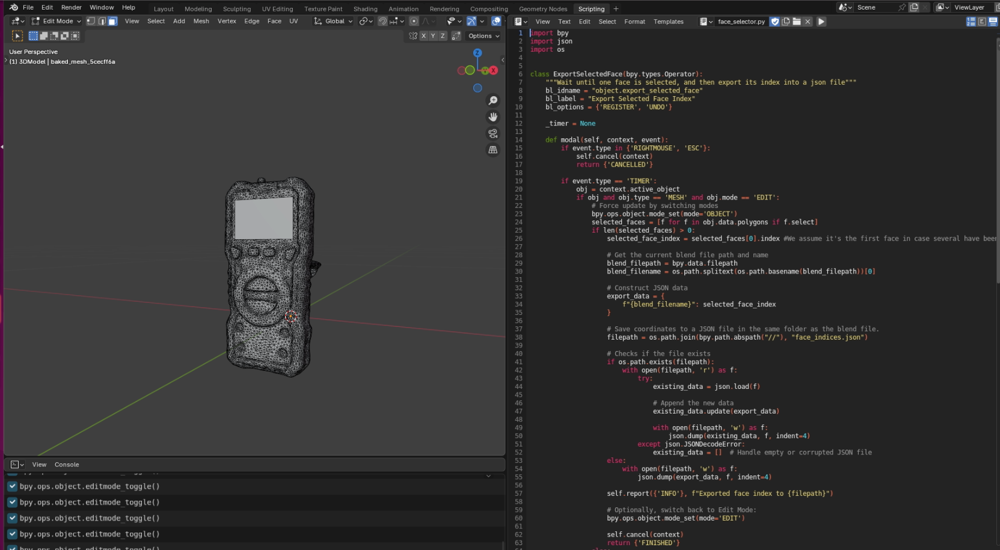

# How to add a new device

## 1 - Add Dictionaries

Dictionaries include the possible range of measurements to use in the generation process of the synthetic display images. Dictionaries must be a **text file**, where each line has one possible measurement only. Inspect how current dictionaries are implemented. 

There are **two** options to create new dictionaries:

1. **Externally**
    * Create the file through external tools or methods. 
    * In this case, simply add the text file in the [dictionaries](displays/dicts/) folder.

1. **Internally**
    * Implement a new case inside the "select_dict" function in the [dictionary script](displays/create_dictionary.py).
    * Add it to the [dictionary mapping](displays/dicts/dicts_list.json) json file.
    * Run the [dictionary script](displays/create_dictionary.py) to generate all dictionaries.


## 2 - Add Real Images

1. Add a folder [here](displays/images/real/) with the new device name. 

1. Inside it, add one **cropped** image per **mode** of the new device. Examples are shown [here](displays/images/real/).

## 3 - Add Metadata Information

Next, metadata information about **each** device and its corresponding real images needs to be added. These include:

1. Image filename.
1. Number of regions of interest (ROI's).
1. Dictionaries.
1. Mode.
1. Label information:
    * Measurement types.
    * Units.

The label information is used exclusively for generating the VQA labels associated with the foreground object renderings.

One example from a real oximiter display image is shown, below:


```json
    {
        "oximeter": [
            {
                "image": "IMG_20250511_184056.jpg",
                "#roi": 2,
                "dictionaries": [
                    "oximeter_spo2",
                    "blood_pressure_device_heart beat"
                ],
                "mode": "Pulse Rate",
                "labels": {
                    "measurement_type": [
                        "SpO2",
                        "Pulse Rate"
                    ],
                    "unit": [
                        "%",
                        "BPM"
                    ]
                },
                "rois": [
                    [
                        27,
                        57,
                        132,
                        94
                    ],
                    [
                        239,
                        73,
                        105,
                        81
                    ]
                ]
            }
        ]
    }
```

The **"rois"** key does not need to be added. This key and corresponding values, which correspond to ROI coordinates, are programatically added during the display generation process.  

The entire metadata file can be visualized [here](displays/roi_mappings.json).

## 4 - Preprocess CAD Model

Before being render-ready, CAD models must be **preprocessed**. Perform the following steps:

1. Open Blender and ensure the CAD model display comprises a **single** rectangular face.
1. Make sure the device name, inside Blender, corresponds to "3DModel".

    

1. Load the custom-developed operator [“ExportSelectedFace”](face_selector.py) in Blender's built-in scripting tab and then select the display face. This will export its index to a [JSON file](models/face_indices.json), which is later used for accurate UV mapping.

    

1. Make sure the CAD model is **oriented** such that the display face's **normal** corresponds to the **positive y axis**, with the **positive x axis** oriented to the **right** (as shown in the image above). 

1. Add the respective .blender file name and an initial display rotation value of 0 degrees to the [UV rotation file](uv_rotation.json). After rendering for the first time, realize how the image is rotated in the display face and change the rotation value accordingly. **Possible values:** 0, 90, -90, 180.